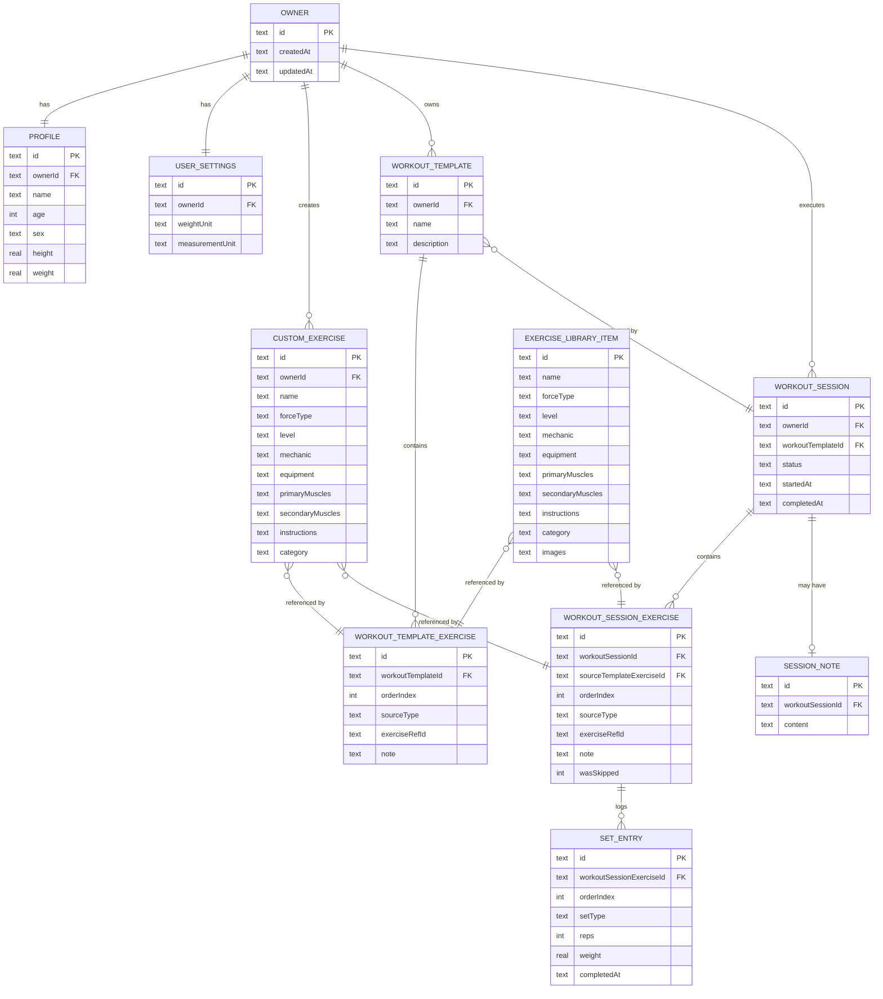
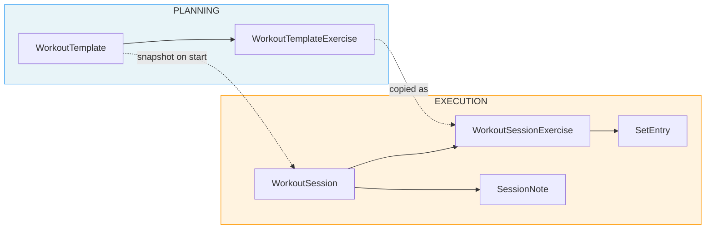
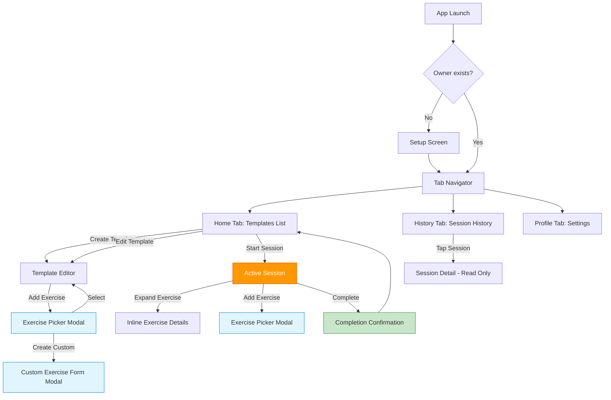
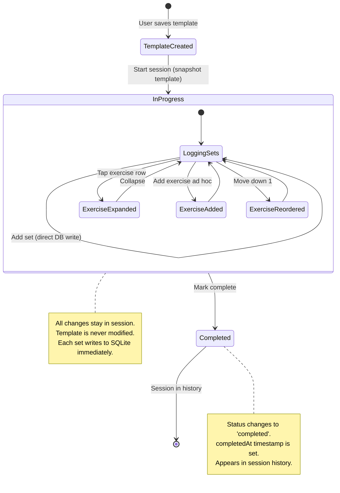
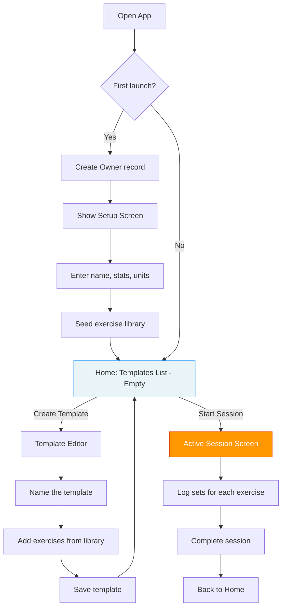
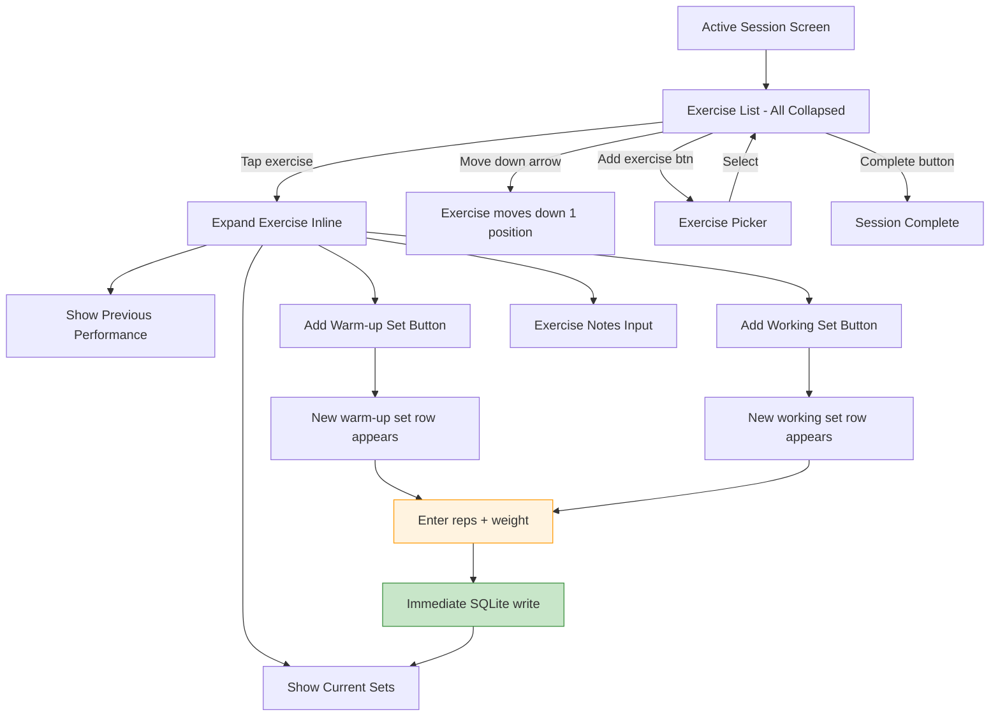
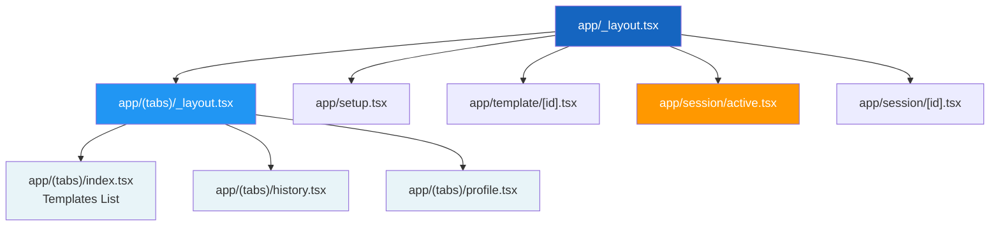

# Diagrams

All diagrams use Mermaid syntax. View in any Mermaid-compatible renderer (GitHub, VS Code extension, mermaid.live).

---

## 1. Entity Relationship Diagram

---

## 2. Planning vs Execution Boundary

---

## 3. Navigation Map

---

## 4. Session Lifecycle

---

## 5. User Flow: First Launch to First Workout

---

## 6. User Flow: Active Session Detail

---

## 7. Expo Router File Structure

